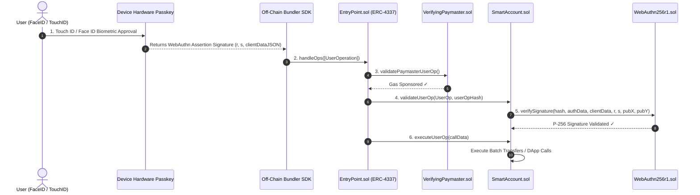

# 🔑 ERC-4337 Passkey Smart Wallet (WebAuthn P-256 & Social Recovery)

[](https://soliditylang.org/)
[](https://eips.ethereum.org/EIPS/eip-4337)
[](https://openzeppelin.com/contracts/)
[](https://nextjs.org/)
[](https://opensource.org/licenses/MIT)

A flagship, production-grade **ERC-4337 Account Abstraction Smart Account Infrastructure** implemented in **Solidity (v0.8.24)** and **Next.js 14**. Features native **WebAuthn P-256 (secp256r1)** hardware Passkey validation (Face ID / Touch ID), **Verifying Paymaster gasless sponsorship**, **Social Guardian recovery** ($M$-of-$N$ threshold key recovery with timelock protection), and **UserOperation bundling**.

---

## 🏗️ System Architecture & Execution Sequence



---

## ✨ Key Features & Technical Highlights

* **Native Hardware Passkey Verification (`WebAuthn256r1.sol`)**: Verifies `secp256r1` (NIST P-256) signatures generated directly by Apple FaceID / TouchID / YubiKeys on-chain without centralized relays.
* **ERC-4337 Account Abstraction (`SmartAccount.sol` & `EntryPoint.sol`)**: Full support for `validateUserOp`, counterfactual CREATE2 deployments (`initCode`), and atomic batch call execution (`executeBatch`).
* **Paymaster Gas Sponsorship (`VerifyingPaymaster.sol`)**: Gasless transactions sponsored by dApps or off-chain paymaster signers.
* **Social Guardian Recovery**: $M$-of-$N$ threshold voting system allowing registered guardians to rotate account Passkey public keys after a 24-hour security timelock.
* **Next.js 14 Control Panel (`src/app/page.tsx`)**: Glassmorphism UI for biometric authentication, counterfactual account deployment, and gasless UserOperation testing.

---

## 📁 Repository Structure

```
02-erc4337-passkey-wallet/
├── .github/
│   └── workflows/
│       └── ci.yml             # GitHub Actions CI pipeline
├── contracts/
│   ├── EntryPoint.sol         # Standard ERC-4337 EntryPoint engine
│   ├── SmartAccount.sol       # Passkey Smart Account & Guardian Recovery
│   ├── WebAuthn256r1.sol      # NIST P-256 WebAuthn signature verifier
│   ├── VerifyingPaymaster.sol # Gasless Paymaster sponsorship contract
│   └── SmartAccountFactory.sol# CREATE2 counterfactual factory
├── src/
│   ├── app/
│   │   ├── layout.tsx         # Root layout with Header
│   │   └── page.tsx           # Passkey Wallet Dashboard UI
│   ├── bundler/
│   │   └── bundler.ts         # UserOperation struct builder
│   ├── passkey/
│   │   └── passkey.ts         # WebAuthn credential helper
│   └── styles/
│       └── globals.css        # Glassmorphism dark mode styling
├── scripts/
│   └── deploy.ts              # Hardhat deployment script
├── test/
│   └── PasskeyAccount.test.ts # Hardhat TypeScript test suite
├── Makefile                   # Shortcut commands
├── hardhat.config.ts          # Hardhat configuration (Solc 0.8.24)
├── package.json               # Dependencies
└── README.md                  # Complete documentation
```

---

## ⚡ Quick Start & Verification

### 1. Installation

```bash
git clone https://github.com/your-username/erc4337-passkey-wallet.git
cd 02-erc4337-passkey-wallet
npm install
```

### 2. Compile Smart Contracts

```bash
npm run compile
# or
make build
```

### 3. Run Smart Contract Test Suite

```bash
npm test
```

### 4. Run Local Next.js Web Dashboard

```bash
npm run dev
# Open http://localhost:3000 in your browser
```

---

## 📜 License

Distributed under the MIT License. See `LICENSE` for details.
